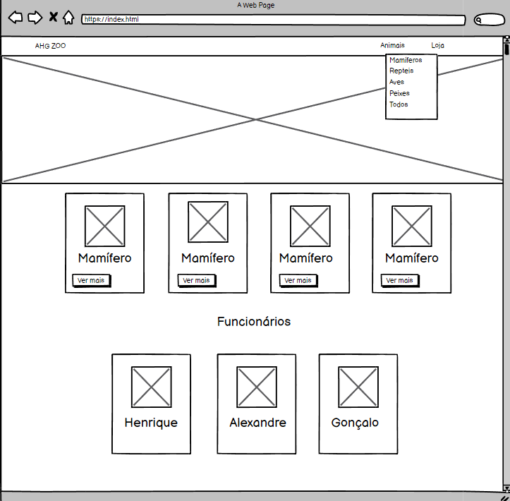
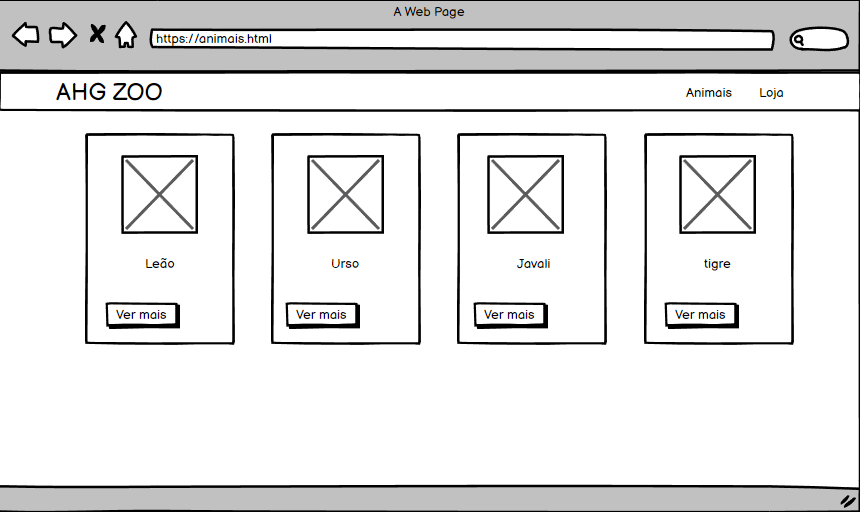
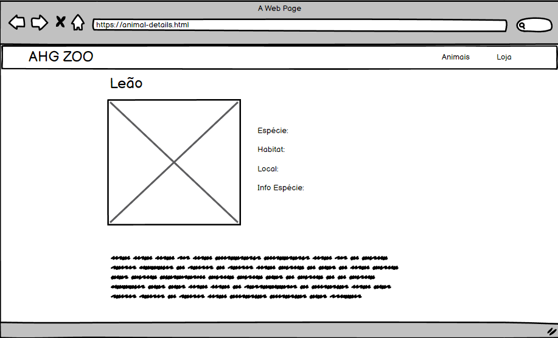
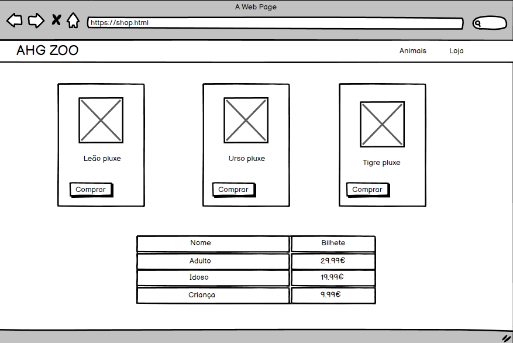

# Interface do Utilizador

## Interface e Características comuns

### Wireframes
| |
:---:
) |
Template da página index.html  |

| |
:---:
) |
Template da página animals.html  |

| |
:---:
) |
Template da página index-details.html  |

| |
:---:
) |
Template da página shop.html  |

### Sitemap

| |
:---:
) |
Sitemap do AHG ZOO |

[< Previous](c1.md) | [^ Main](../README.md) | [Next >](c3.md)
:--- | :---: | ---: 