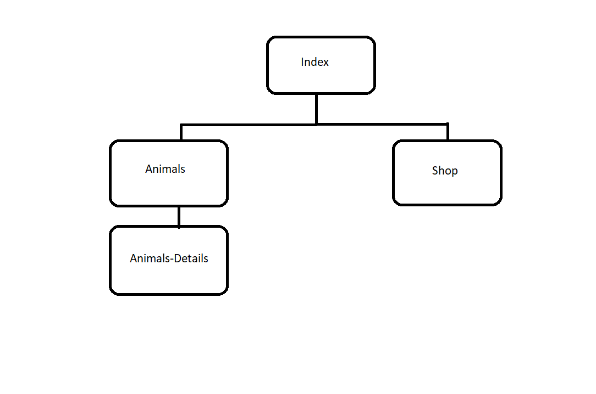

# Interface do Utilizador

## Interface e Características comuns

### Wireframes

### Sitemap

| |
:---:
) |
Sitemap do AHG ZOO |

[< Previous](c1.md) | [^ Main](../README.md) | [Next >](c3.md)
:--- | :---: | ---: 