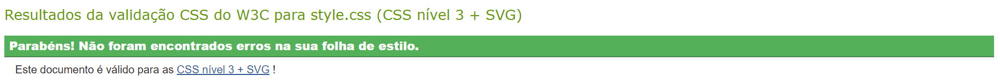

# C3 : Produto

O projeto realizado é um website estático para demonstrar um zoo, onde iremos ter uma lista dos animais que existem nesse zoo, e uma breve descrição deles, para acrescentar também acrescentamos uma loja, onde se consegue ver os enumeros artigos que o zoo vende ao público e o preço dos bilhetes dependendo da idade de cada cliente.

## 3.1 Instalação

Para conseguir correr o projeto localmente, precisa de abrir o VS Code e instalar a extensão Live Server, depois de já estar instalado vá ao documento index.html, click com o botão direito e selecionar "Open with Live Server"

Para correr no netlify ...

## 3.2 Utilização 

Para utilizar o nosso site não precisa de nenhuma regra de utilização, apenas abrir o link e desfrutrar do nosso zoo e apreciar os nossos animais.

## 3.3 Aplicação

Para a navegação nós usamos uma navbar onde temos duas secções, a dos Animais e a da Loja. A dos animais consiste numa dropdown que, quando carregado, mostra os tipos dos animais que temos (Mamíferos, Repteis, Aves, Peixes  e todos eles), para ajudar o cliente caso tenha alguma preferência. A Loja é apenas um link que redireciona para a página da loja.

Quando o site, está em tamanhos mais reduzidos substituimos a navbar mencionada anteriormente para uma navbar com um menu hamburguer para que seja mais fácil a sua utilização, assim o utilizador apenas precisa
de carregar no meu hamburguer para ver todas as página que temos.

## 3.4 Formulários

 FAZER

## 3.5 Validação do HTML5 e CSS3 

Para validarmos o HTML5 e o CSS3 utilizamos o W3C Validator (https://validator.w3.org/) que consiste num validador de marcação gratis fornecido pelo W3C que valida documentos Web

### Validação CSS

 

### Validação HTML 

## 3.6 Detalhes da implementação

[< Previous](c2.md) | [^ Main](../README.md) | [Next >](c4.md)
:--- | :---: | ---: 

